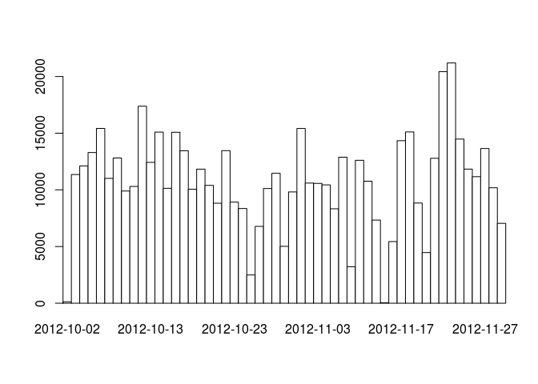
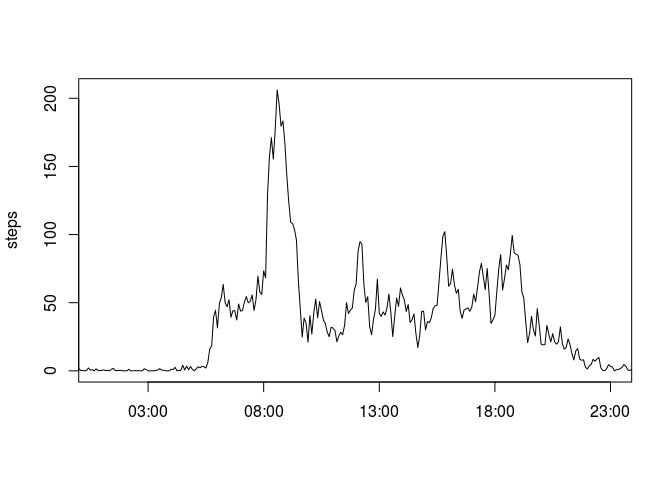
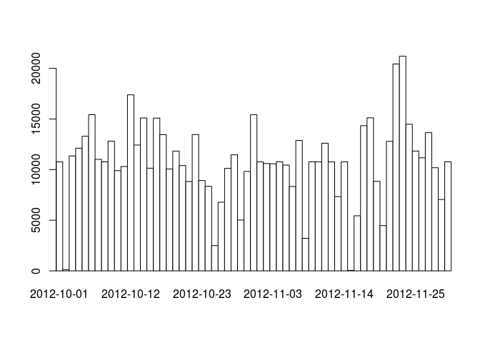
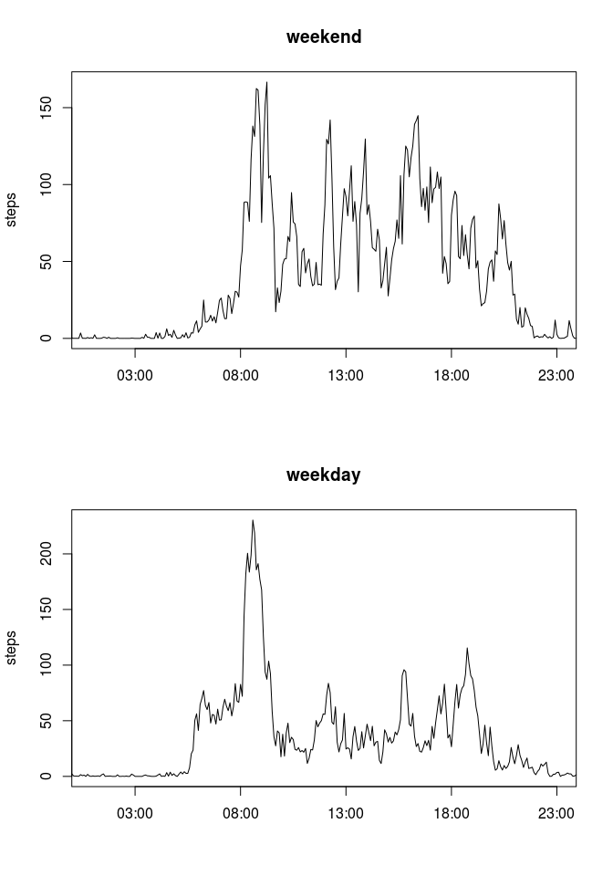

# Reproducible Research: Peer Assessment 1

## Loading and preprocessing the data

```r
activity <- read.csv('activity.csv')
activity$date <- as.Date(activity$date)
summary(activity)
```

```
##      steps             date               interval     
##  Min.   :  0.00   Min.   :2012-10-01   Min.   :   0.0  
##  1st Qu.:  0.00   1st Qu.:2012-10-16   1st Qu.: 588.8  
##  Median :  0.00   Median :2012-10-31   Median :1177.5  
##  Mean   : 37.38   Mean   :2012-10-31   Mean   :1177.5  
##  3rd Qu.: 12.00   3rd Qu.:2012-11-15   3rd Qu.:1766.2  
##  Max.   :806.00   Max.   :2012-11-30   Max.   :2355.0  
##  NA's   :2304
```


## What is mean total number of steps taken per day?

```r
complete_cases <- activity[complete.cases(activity),]
steps_by_day <- aggregate(steps ~ date, data = complete_cases, sum)

par(mfrow = c(1, 1))
barplot(tapply(complete_cases$steps, complete_cases$date, sum), main="", space=0, xaxs="i", col="White") # close enough to histogram
```

<!-- -->

Number of steps taken per day:

* mean: 10766.19
* median: 10765


## What is the average daily activity pattern?

```r
steps_by_interval <- aggregate(steps ~ interval, data = activity, mean)
steps_by_interval <- steps_by_interval[order(steps_by_interval$interval),]
steps_by_interval$interval <- as.POSIXct(sprintf("%04d", steps_by_interval$interval), format="%H%M")
par(mfrow = c(1, 1))
plot(steps_by_interval, type='l', xaxs="i", xlab="", sub="")
```

<!-- -->


5-minute interval with largest number of steps is 08:35-08:40.

## Imputing missing values

```r
missing_values <- activity[is.na(activity$steps),]
```

Total number of missing values in the dataset is 2304.

Imput missing data with mean number of steps for same interval in all other days.

```r
mean_by_int <- aggregate(steps ~ interval, data = complete_cases, mean)
activity_f <- data.frame(activity)
get_mean_of_interval <- function(row) {
  mean_by_int[mean_by_int$interval==as.integer(row['interval']),]$steps
}
activity_f[is.na(activity_f$steps),]$steps <- apply(missing_values, 1, get_mean_of_interval)
steps_by_day_f <- aggregate(steps ~ date, data = activity_f, sum)

par(mfrow = c(1, 1))
barplot(tapply(activity_f$steps, activity_f$date, sum), main="", space=0, xaxs="i", col="White")
```

<!-- -->

Such strategy made negligible changes on mean and median number of steps taken per day:

* mean: 10766.19
* median: 10766.19


## Are there differences in activity patterns between weekdays and weekends?


```r
#activity$time <- as.POSIXct(paste(activity$date, " ", sprintf("%04d", activity$interval)), format="%Y-%m-%d %H%M")
#subset(activity, select = -c(date, interval))

activity_f$day_t <- ifelse(format(activity_f$date, "%w") %in% c('0', '6'), "weekend", "weekday")
activity_f$day_t <- factor(activity_f$day_t)

steps_by_int_f_we <- aggregate(steps ~ interval, data = activity_f[activity_f$day_t=="weekend",], mean)
steps_by_int_f_we$interval <- as.POSIXct(sprintf("%04d", steps_by_int_f_we$interval), format="%H%M")

steps_by_int_f_wd <- aggregate(steps ~ interval, data = activity_f[activity_f$day_t=="weekday",], mean)
steps_by_int_f_wd$interval <- as.POSIXct(sprintf("%04d", steps_by_int_f_wd$interval), format="%H%M")

par(mfrow = c(2,1))
plot(steps_by_int_f_we, type='l', xaxs="i", xlab="", sub="", main="weekend")
plot(steps_by_int_f_wd, type='l', xaxs="i", xlab="", sub="", main="weekday")
```

<!-- -->
